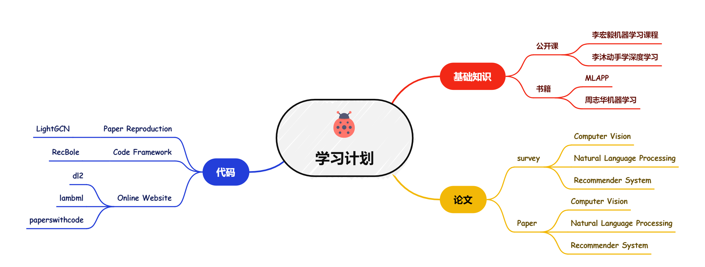

# 基础知识、论文、代码学习进度安排

## 学习任务

🔥🔥🔥 **基础知识**  
**[Course](./course)** | **[Book](./book)**

基础知识的学习包括两部分：网课和书籍，优先学习基础知识的学习包括两部分：网课和书籍。上述课程链接为 [李宏毅2021/2022春机器学习课程](https://www.bilibili.com/video/BV1Wv411h7kN/?spm_id_from=333.337.search-card.all.click)，书籍链接为一些机器学习相关的电子版书籍，存储在[github](./book)中，同时我们也购买了多本纸质书籍以供借阅。:sparkles:  

优先学习李宏毅机器学习课程和 MLAPP (第二版)两本书籍。大家也可根据自身需要学习其他课程和书籍。

**任务安排参考如下**：每周学习一节课程、每周阅读一章书籍。 :star2:

---

🔥🔥🔥 **经典论文**  
**[Survey](./paper)** | **[Paper](./paper)**

整理的论文包括以下几类：CV、NLP、RS、LLM等。具体的论文列表参考上述链接。 :sparkles:  

整理的论文列表供大家参考，经典论文的阅读旨在提升论文阅读能力。大家也可根据自身需要搜索阅读感兴趣或与自身研究方向的论文。

[论文阅读写作小技巧](https://e1nqigcg04q.feishu.cn/wiki/RKgwwGoweixHXekOFSCc8wLrnGd?fromScene=spaceOverview)

**任务安排参考如下**：每周1~2篇论文。 :star2:

---

🔥🔥🔥 **代码能力**  
**[Paper Code](./code)** | **[Code Framework](./code)** | **[Online Website](./web)**

代码学习包含以下三部分：**论文代码**、**代码框架**、**在线学习网站**。经典论文的代码需要大家阅读理解后进行仿写，代码框架需要大家跑通并掌握整体流程，在线网站非常方便大家由浅入深的学习。 :sparkles:

除了仓库中供参考的这些代码之外，大家也可选择阅读一些具有开源代码的论文并复现，或参加比赛等。

**任务安排参考如下**：每1~2周复现一篇经典论文的代码，或每周在 dl2.ai 等网站上学习适量内容等。 :star2:

## 学习进度表

- **Content**  列分别记录每周分享的内容 ”课程、论文、书籍“
-    **Note**  列记录分享人员整理的笔记
-  **Sharer**  列是每周需要进行分享的人员，名称被加粗的负责组织本周的分享会

| Week | Content | Note | Sharer |
| :--: | :-----: | :--: | :----: |
|      |         |      |        |
|      |         |      |        |
|      |         |      |        |
|      |         |      |        |
|      |         |      |        |
|      |         |      |        |
|      |         |      |        |
